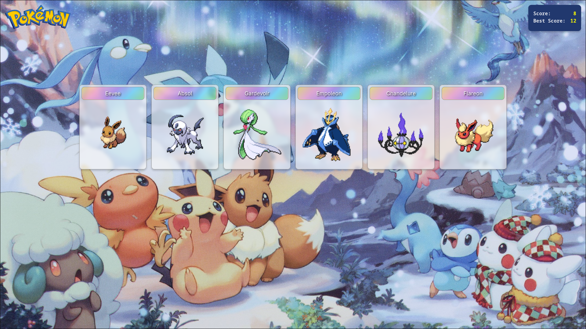

# The Odin Project - Full Stack JavaScript
## #17 Project: Memory Card
A memory card game made in React.



### Building
You can run this app locally by cloning the repo and installing its dependencies:
```
git clone https://github.com/Vittv/memory-card.git
cd cv-application
npm install
```

Then you can open the local server with:
```
npm run dev
```

It should then be available at `http://localhost:5173`.
